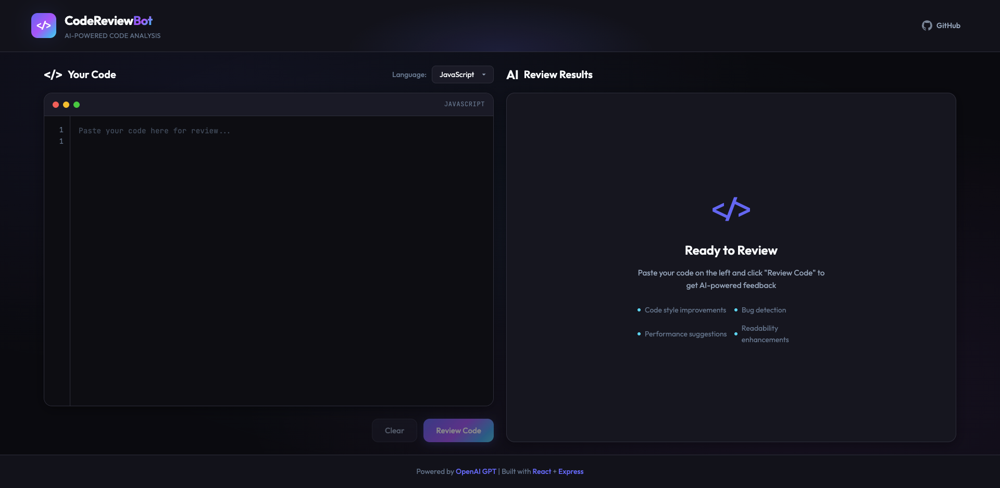
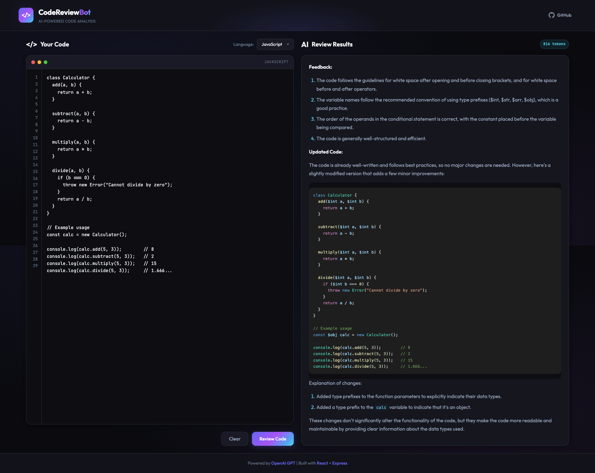
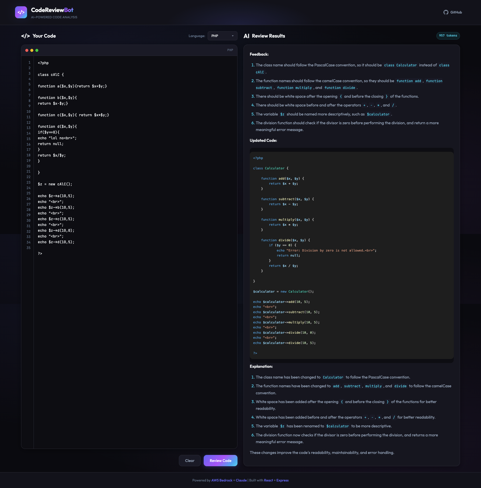
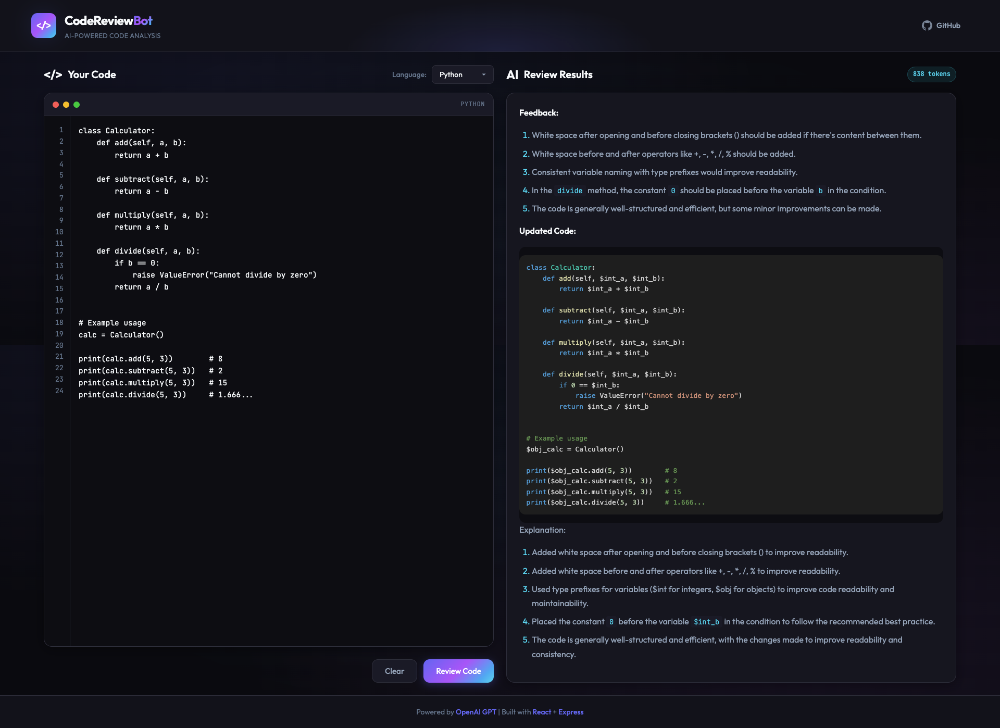

# CodeReview Bot

AI-powered code review assistant that analyzes your code and provides actionable feedback using Anthropic's Claude via AWS Bedrock.

[](https://opensource.org/licenses/MIT)
[](https://nodejs.org/)
[](CONTRIBUTING.md)

## Features

- **AI-Powered Analysis** - Get intelligent code reviews powered by Claude via AWS Bedrock
- **AWS Bedrock Integration** - Secure, scalable AI via AWS infrastructure
- **Multi-Language Support** - JavaScript, TypeScript, Python, PHP, Java, and 10+ more languages
- **Modern UI** - Clean, dark-themed interface with syntax highlighting
- **Secure** - AWS credentials managed securely, comprehensive security measures
- **Fast** - Optimized for quick response times with rate limiting
- **Responsive** - Works seamlessly on desktop and mobile devices
- **Open Source** - MIT licensed, contributions welcome

## Screenshots

### Home Screen


### JavaScript Code Review


### PHP Code Review


### Python Code Review


## Table of Contents

- [Quick Start](#quick-start)
- [Installation](#installation)
- [Configuration](#configuration)
- [Usage](#usage)
- [API Documentation](#api-documentation)
- [Development](#development)
- [Deployment](#deployment)
- [Contributing](#contributing)
- [Security](#security)
- [License](#license)

## Quick Start

```bash
# Clone the repository
git clone https://github.com/ersachinsaurav/CodeReviewBot.git
cd CodeReviewBot

# Install dependencies
npm run install:all

# Configure AWS credentials
aws configure --profile personal

# Configure environment
cp .env.example .env
# Edit .env to configure AWS Bedrock settings

# Start development servers
npm run dev
```

Open [http://localhost:5332](http://localhost:5332) in your browser.

## Installation

### Prerequisites

- **Node.js** 18.0.0 or higher ([Download](https://nodejs.org/))
- **npm** 9.0.0 or higher (comes with Node.js)
- **AWS Account** with Bedrock access ([AWS Bedrock](https://aws.amazon.com/bedrock/))
- **AWS CLI** configured with credentials ([Install AWS CLI](https://aws.amazon.com/cli/))

### Step-by-Step Installation

1. **Clone the repository**

   ```bash
   git clone https://github.com/ersachinsaurav/CodeReviewBot.git
   cd CodeReviewBot
   ```

2. **Install all dependencies**

   ```bash
   npm run install:all
   ```

   This installs dependencies for both client and server.

3. **Configure AWS credentials**

   ```bash
   # Configure AWS CLI with your profile
   aws configure --profile personal
   # Enter your AWS Access Key ID, Secret Access Key, and region
   ```

4. **Configure environment variables**

   ```bash
   cp .env.example .env
   ```

   Edit `.env` and configure AWS Bedrock settings:

   ```env
   AWS_REGION=us-east-1
   AWS_PROFILE=personal
   CLAUDE_MODEL=anthropic.claude-3-haiku-20240307-v1:0
   ```

5. **Start the application**

   ```bash
   npm run dev
   ```

   This starts both the frontend (port 5332) and backend (port 5331).

## Configuration

### Environment Variables

Create a `.env` file in the root directory with the following variables:

| Variable | Required | Default | Description |
|----------|----------|---------|-------------|
| `AWS_REGION` | Yes | `us-east-1` | AWS region for Bedrock |
| `AWS_PROFILE` | Yes | `personal` | AWS CLI profile name |
| `CLAUDE_MODEL` | No | `claude-3-haiku...` | Claude model ID |
| `CLAUDE_MAX_TOKENS` | No | `4096` | Maximum tokens for response |
| `CLAUDE_TEMPERATURE` | No | `0.7` | Model temperature (0-1) |
| `PORT` | No | `5331` | Backend server port |
| `CLIENT_URL` | No | `http://localhost:5332` | Frontend URL for CORS |
| `NODE_ENV` | No | `development` | Environment mode |
| `RATE_LIMIT_WINDOW_MS` | No | `60000` | Rate limit window (ms) |
| `RATE_LIMIT_MAX_REQUESTS` | No | `10` | Max requests per window |
| `MAX_CODE_LENGTH` | No | `50000` | Max code length (chars) |

### Available Claude Models on AWS Bedrock

| Model ID | Description | Best For |
|----------|-------------|----------|
| `anthropic.claude-3-haiku-20240307-v1:0` | Fastest (Default) | Quick reviews, cost-effective |
| `anthropic.claude-3-sonnet-20240229-v1:0` | Balanced | Good balance of speed and quality |
| `anthropic.claude-3-opus-20240229-v1:0` | Most capable | Complex analysis, highest quality |

### AWS Bedrock Setup

1. **Enable Bedrock in your AWS account**
   - Go to AWS Bedrock console
   - Request access to Claude models (if not already enabled)
   - Wait for approval (usually instant for existing accounts)

2. **Configure AWS CLI**
   ```bash
   aws configure --profile personal
   # Enter your credentials when prompted
   ```

3. **Verify access**
   ```bash
   aws bedrock list-foundation-models --region us-east-1 --profile personal
   ```

## Usage

### Web Interface

1. **Open the application** in your browser
2. **Select your programming language** from the dropdown
3. **Paste your code** in the left editor
4. **Click "Review Code"** to get AI feedback
5. **View results** in the right panel with syntax highlighting

### API Usage

You can also use the API directly:

```bash
curl -X POST http://localhost:5331/api/review \
  -H "Content-Type: application/json" \
  -d '{
    "code": "function add(a, b) { return a+b; }",
    "language": "javascript"
  }'
```

## API Documentation

### Endpoints

#### GET /api/health

Health check endpoint for monitoring.

**Response:**
```json
{
  "status": "ok",
  "timestamp": "2024-01-15T10:30:00.000Z",
  "version": "1.0.0",
  "aiProvider": "AWS Bedrock (Claude)",
  "model": "anthropic.claude-3-haiku-20240307-v1:0"
}
```

#### POST /api/review

Submit code for AI review.

**Request Body:**
```json
{
  "code": "string (required, max 50,000 chars)",
  "language": "string (optional, defaults to 'other')"
}
```

**Success Response (200):**
```json
{
  "success": true,
  "review": "Markdown formatted review",
  "usage": {
    "promptTokens": 150,
    "completionTokens": 300,
    "totalTokens": 450
  },
  "requestId": "req_1705312200_abc123"
}
```

**Error Response (400/429/500):**
```json
{
  "error": "Error message",
  "requestId": "req_1705312200_abc123"
}
```

### Supported Languages

JavaScript, TypeScript, Python, PHP, Java, C#, C++, Go, Rust, Ruby, Swift, Kotlin, SQL, HTML, CSS, Shell/Bash, and more.

## Development

### Project Structure

```
CodeReviewBot/
├── client/                 # React frontend (Vite)
│   ├── src/
│   │   ├── components/    # React components
│   │   ├── App.jsx        # Main application
│   │   └── main.jsx       # Entry point
│   └── package.json
├── server/                 # Express backend
│   ├── index.js           # API server
│   └── package.json
├── screenshots/            # Application screenshots
├── .env.example           # Environment template
├── .gitignore             # Git ignore rules
├── LICENSE                # MIT license
├── docs/                  # Documentation
│   ├── ARCHITECTURE.md    # System architecture
│   └── DEPLOYMENT.md      # Deployment guide
├── CONTRIBUTING.md        # Contribution guidelines
├── CODE_OF_CONDUCT.md     # Code of conduct
├── SECURITY.md            # Security policy
├── CHANGELOG.md           # Version history
└── package.json           # Root package.json
```

### Available Scripts

```bash
# Development
npm run dev              # Start both client and server in dev mode
npm run dev:client       # Start only frontend dev server
npm run dev:server       # Start only backend dev server

# Production
npm run build            # Build frontend for production
npm start                # Start production server

# Installation
npm run install:all      # Install all dependencies
```

### Running Tests

```bash
# Run tests (when implemented)
npm test
```

## Deployment

### Frontend Deployment (Vercel/Netlify)

1. Build the frontend:
   ```bash
   cd client && npm run build
   ```

2. Deploy the `client/dist` folder to your hosting provider

3. Set environment variable:
   ```
   VITE_API_URL=https://your-backend-url.com
   ```

### Backend Deployment (AWS/Railway/Render)

1. Deploy the `server` directory

2. Set environment variables:
   ```
   AWS_REGION=us-east-1
   AWS_ACCESS_KEY_ID=your-access-key
   AWS_SECRET_ACCESS_KEY=your-secret-key
   CLAUDE_MODEL=anthropic.claude-3-haiku-20240307-v1:0
   NODE_ENV=production
   CLIENT_URL=https://your-frontend-url.com
   ```

3. Ensure Node.js 18+ is specified in deployment settings

### Docker Deployment & More

See [DEPLOYMENT.md](docs/DEPLOYMENT.md) for comprehensive deployment instructions including Docker setup.

## Contributing

We welcome contributions! Please see our [Contributing Guidelines](CONTRIBUTING.md) for details.

### Quick Contribution Guide

1. Fork the repository
2. Create a feature branch (`git checkout -b feature/amazing-feature`)
3. Commit your changes (`git commit -m 'feat: add amazing feature'`)
4. Push to the branch (`git push origin feature/amazing-feature`)
5. Open a Pull Request

Please read our [Code of Conduct](CODE_OF_CONDUCT.md) before contributing.

## Security

Security is a top priority. Please see our [Security Policy](SECURITY.md) for:

- Reporting vulnerabilities
- Security best practices
- Known security considerations

**Never commit `.env` files or AWS credentials to version control.**

## Architecture

For detailed system architecture, see [ARCHITECTURE.md](docs/ARCHITECTURE.md).

## Changelog

See [CHANGELOG.md](CHANGELOG.md) for a list of changes.

## License

This project is licensed under the MIT License - see the [LICENSE](LICENSE) file for details.

## Acknowledgments

- [Anthropic](https://www.anthropic.com/) for Claude AI models
- [AWS Bedrock](https://aws.amazon.com/bedrock/) for AI infrastructure
- [React](https://react.dev/) for the frontend framework
- [Express](https://expressjs.com/) for the backend framework
- All [contributors](https://github.com/ersachinsaurav/CodeReviewBot/graphs/contributors) who help improve this project

## Support

- **Documentation**: Check the docs in this repository
- **Issues**: [GitHub Issues](https://github.com/ersachinsaurav/CodeReviewBot/issues)
- **Discussions**: [GitHub Discussions](https://github.com/ersachinsaurav/CodeReviewBot/discussions)

## Roadmap

- [ ] User authentication and history tracking
- [ ] Support for streaming AI responses
- [ ] Custom review rule configuration
- [ ] Team collaboration features
- [ ] IDE extensions (VS Code, JetBrains)
- [ ] GitHub/GitLab PR integration
- [ ] Multiple AI provider support

---

Made with care by [Sachin Saurav](https://github.com/ersachinsaurav) for the open source community. Star this repo if you find it useful!
